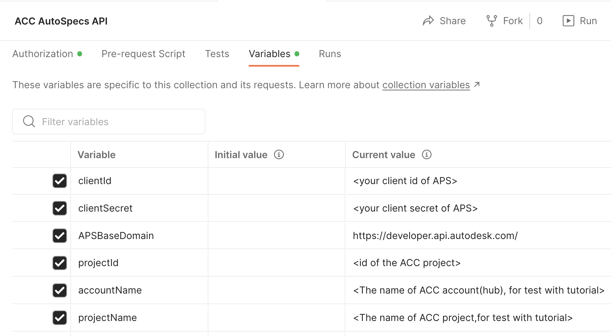

# Postman Collection for ACC AutoSpecs API

[](https://www.getpostman.com/)

[](https://aps.autodesk.com/en/docs/oauth/v2/overview/)

[](https://aps.autodesk.com/en/docs/acc/v1/overview/)

[](https://aps.autodesk.com/en/docs/acc/v1/overview/field-guide/autospecs/)


[](http://opensource.org/licenses/MIT)

## Description
This folder contains a Postman Collection that includes all the endpoints of current ACC AutoSpecs API and the demo tutorials. The collection will be kept updated with new APIs.  

### Setup Postman environment

- Import Postman collection file. It contains the endpoints test, predefined **variables** of collection environment and predefined **Authorization**.  

- Input your information in  **variables** tab
   If you want to test from _Run Firstly_, input the environment variables only: clientId, clientSecret, accountName, projectName. If you have known the projectId, input its value directly.

    <p align="center"></p>  

- ensure the callback url of your APS application is 
```https://www.getpostman.com/oauth2/callback```

### API Test

1. Assume the steps of **Setup** have been performed. The 3-legged token is ready.

2. Input id of ACC project which has AutoSpec enabled. Play the scripts, try to change some parameters or body with more scenarios.

3. To test [tutorial](https://aps.autodesk.com/en/docs/acc/v1/tutorials/autospecs/upload-document/), input accountName and projectName firstly. The step1 and step2 will get account id and project id.

4. With [Postman Runner](https://learning.postman.com/docs/running-collections/intro-to-collection-runs/), these scripts can be chained to perform auto-test. Check **Tests** tab to define your preferred tests. 

### Documentation

- [AutoSpecs API Field Guid](https://aps.autodesk.com/en/docs/acc/v1/overview/field-guide/autospecs/)
- [AutoSpecs API API Reference](https://aps.autodesk.com/en/docs/acc/v1/reference/http/autospecs-getprojectmetadata-GET/)
- [AutoSpecs API Tutorial](https://aps.autodesk.com/en/docs/acc/v1/tutorials/autospecs/upload-document/)


### License
This sample is licensed under the terms of the [MIT License](http://opensource.org/licenses/MIT). Please see the [LICENSE](../LICENSE) file for full details.

### Written by
Xiaodong Liang [@coldwood](https://twitter.com/coldwood), [Developer Advocate and Support](http://aps.autodesk.com)
