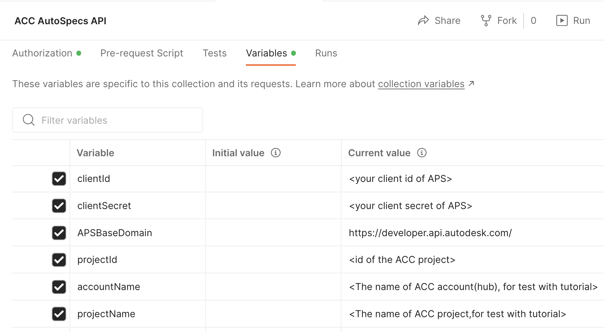
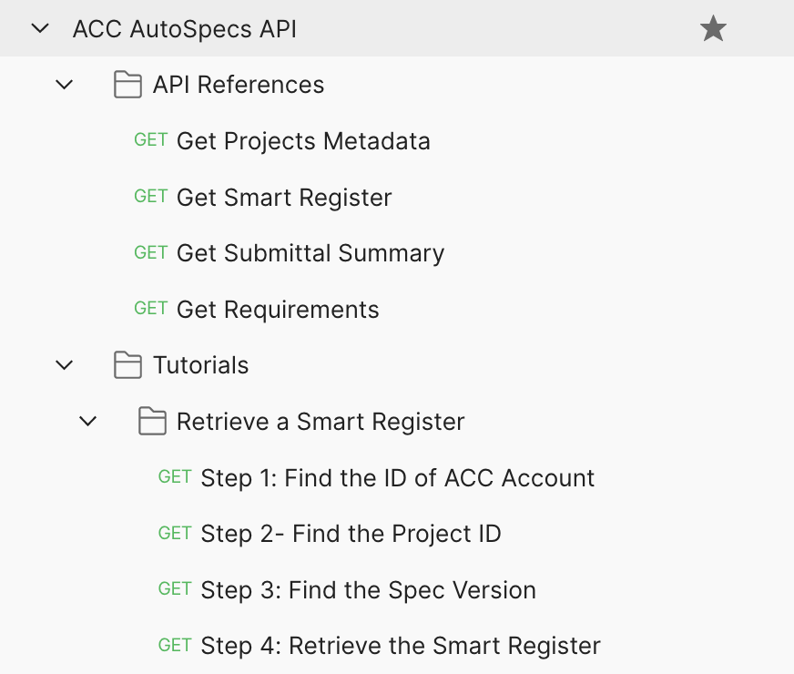
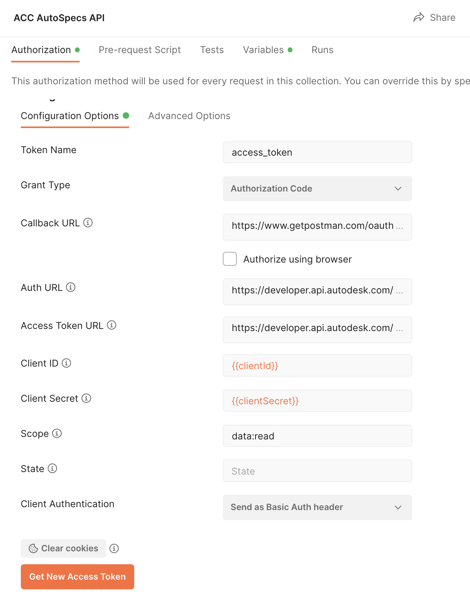

# Postman Collection for ACC AutoSpecs API

This folder contains a Postman Collection that includes all the current ACC AutoSpecs API. The collection together with the environment help you easily test these endpoints.

 

### Setup Postman environment
- Import Postman collection
- Setup the following environment in **variables** tab: 
    - clientId:     APS App Id
    - clientSecret: APS App Secret
    - projectId: id of the ACC project(for test with API References, input the project id directly)
    - accountName: The name of ACC account(hub) (for test with tutorial from step 1) 
    - projectName:  The name of ACC project (for test with tutorial from step 1 ) 
   
   

 

### Setup Authorization and Generate Token
This collection takes **[Inheriting auth](https://learning.getpostman.com/docs/postman/sending-api-requests/authorization/#inheriting-auth)** to apply token to every endpoint in the collection automatically 

   In tab **Authorization** of the collection. switch type to **OAuth 2.0**. Input the variables in __Authorization__.

   - Grant Type ``Authorization Code``
   - Callback URL  ``https://www.getpostman.com/oauth2/callback``
   - Auth URL  ``https://developer.api.autodesk.com/authentication/v2/authorize``
   - Access Token URL  ``https://developer.api.autodesk.com/authentication/v2/token``
   - Client ID ``{{clientId}}``
   - Client Secret ``{{clientSecret}}``
   - Scope ``data:read``
   - Client Authentication ``Send As Basic Auth Header``

   Click **Get New Access Token**, it will direct to login Autodesk account, after it succeeds, the token will be generated. Click **Save** if it is enabled.  

   

 

### API Test

1. Assume the steps of **Setup** have been performed. The access token is ready.

2. Input id of ACC project which has AutoSpec enabled. Play the scripts, try to change some parameters or body with more scenarios.

3. To test tutorial, input accountName and projectName firstly. The step1 and step2 will get account id and project id.

   

 

3. With [Postman Runner](https://learning.postman.com/docs/running-collections/intro-to-collection-runs/), these scripts can be chained to perform auto-test. Check **Tests** tab to define your preferred tests. 

### Documentation

- [AutoSpecs API Field Guid](https://aps.autodesk.com/en/docs/acc/v1/overview/field-guide/autospecs/)
- [AutoSpecs API API Reference](https://aps.autodesk.com/en/docs/acc/v1/reference/http/autospecs-getprojectmetadata-GET/)
- [AutoSpecs API Tutorial](https://aps.autodesk.com/en/docs/acc/v1/tutorials/autospecs/upload-document/)

### License
This sample is licensed under the terms of the [MIT License](http://opensource.org/licenses/MIT). Please see the [LICENSE](../LICENSE) file for full details.

### Written by
Xiaodong Liang [@coldwood](https://twitter.com/coldwood), [Developer Advocate and Support](http://aps.autodesk.com)
