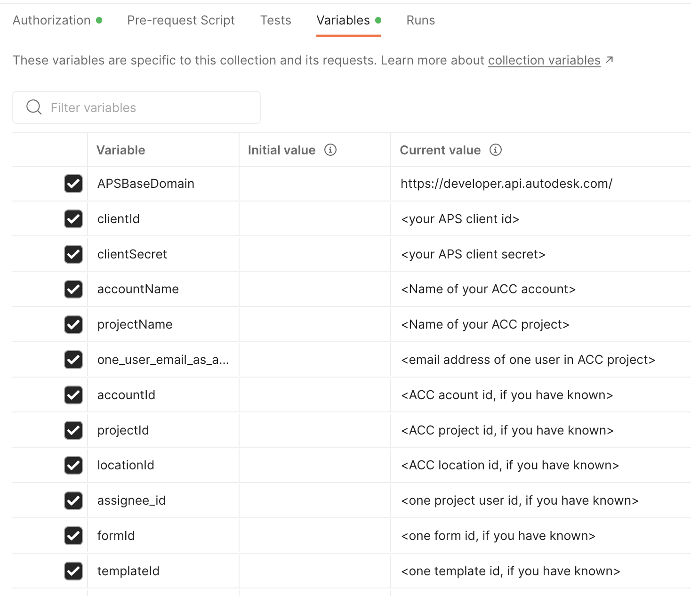

# Postman Collection for Forms API

[](https://www.getpostman.com/)

[](https://aps.autodesk.com/en/docs/oauth/v2/overview/)

[](https://aps.autodesk.com/en/docs/acc/v1/overview/)

[](https://aps.autodesk.com/en/docs/acc/v1/overview/field-guide/forms/)


[](http://opensource.org/licenses/MIT)

## Description
This folder contains a Postman Collection that includes all the endpoints of current ACC Forms API and the demo tutorials. The collection will be kept updated with new APIs.  

### Setup Postman environment

- Import Postman collection file. It contains the endpoints test, predefined **variables** of collection enviroment and predefined **Authorization**. The endpoints test includes _Run Firstly_ which gets account id, project id, assignee id etc firstly. Tutorials includes a few demo workflows. API Reference provides the demo of each API endpoint.

- Input your information in  **variables** tab
   If you want to test from _Run Firstly_, input the environment variables only: clientId, clientSecret, accountName, projectName, one_user_email_as_assignee. 

   If you want to test specific endpoints directly, input the necessary data in advance (e.g. projectId, formId etc..)

    <p align="center"></p>  

- ensure the callback url of your APS application is 
```https://www.getpostman.com/oauth2/callback```


### API Test

1. Create some pdf and non-pdf templates in ACC UI firstly. In non-pdf forms, create some custom fields and add some tables (materials, equipments, worklog).

2. Generate the 3-legged token from **Authorization** tab. This collection takes **[Inheriting auth](https://learning.getpostman.com/docs/postman/sending-api-requests/authorization/#inheriting-auth)** to apply token to every endpoint in the collection automatically.

3. Assume only account name, project name and one user email are available in **variables**, click the test scripts in _Run First_ in sequence.

4. To test tutorial, click the test scripts in sequence. 

   In the tutorial **Manage Forms** 
      Step 1: get one non-pdf template
      Step 2: create a form with that. After creation, the post-scripts will collect available fields ids of text, number, date, choice, signature, table etc, for the subsequent test. 
      Step 3: edit some general attributes of the forms.
      Step 4: in pre-scripts, it will check if any fields ids of text, number, date, choice, signature is available, if any table is available. Prepare some input values for the corresponding fields or tables. The payload will be stringfy as a variable. This variable will be used as a payload in Body in this request.
      Step 5: edit some other general attributes of the forms such as change its status.
 
5. In API References, it shows the basic usage of the API endpoints. For updating the field values of non-pdf form,  a few scenarios are provided:

   - update text, date, number, toggle: these are similar. fieldId and corresponding value
   - update signatures: this will need fieldId, based64 encoded string and signature name.
   - update tables: the rows with columns will be defined
   - update choice, array: these are similar. The demo will be provides soon.

6. With [Postman Runner](https://learning.postman.com/docs/running-collections/intro-to-collection-runs/), these scripts can be chained to perform auto-test. Check **Tests** tab to define your preferred tests. 

### Documentation

- [Forms API Field Guid](https://aps.autodesk.com/en/docs/acc/v1/overview/field-guide/forms/)
- [Forms API Reference](https://aps.autodesk.com/en/docs/acc/v1/reference/http/autospecs-getprojectmetadata-GET/)
- [Forms API Tutorial](https://aps.autodesk.com/en/docs/acc/v1/reference/http/forms-valuesbatch-update-PUT/)


### License
This sample is licensed under the terms of the [MIT License](http://opensource.org/licenses/MIT). Please see the [LICENSE](../LICENSE) file for full details.

### Written by
Xiaodong Liang [@coldwood](https://twitter.com/coldwood), [Developer Advocate and Support](http://aps.autodesk.com)

 