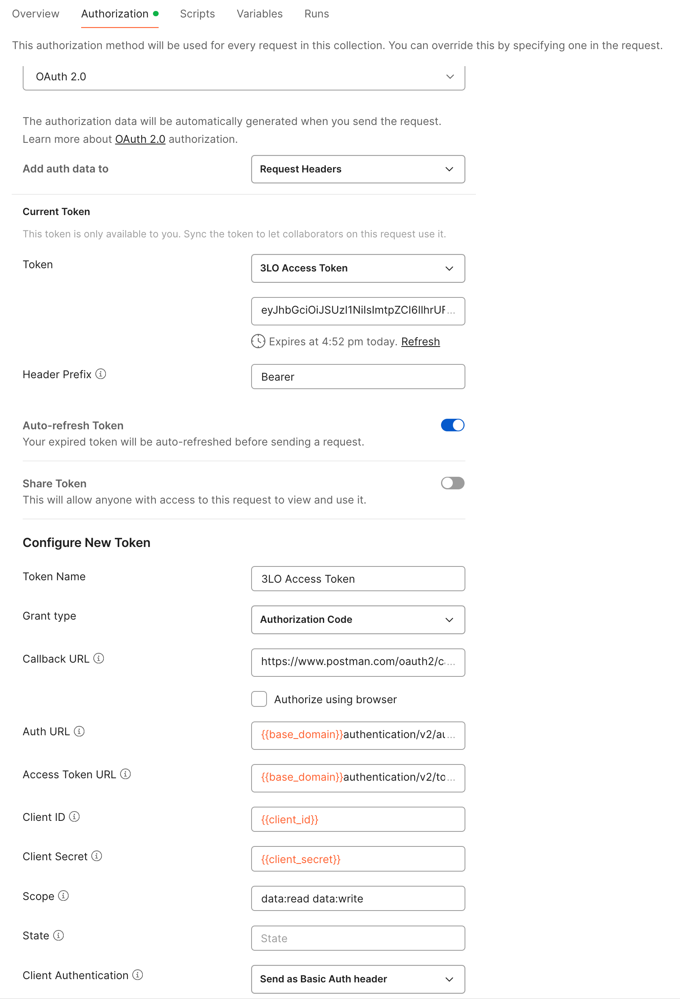

# Postman Collection for ACC Photos API

This folder contains a Postman Collection that includes all the current ACC Photos API. The collection together with the environment help you easily test these endpoints.

## Instructions to run the Postman collection are as below

### Setup Postman environment and Authorization:
- Import Postman environment & collection, please setup the following environment vialables, 
    - client_id:     APS App Id.
    - client_secret: APS App Secret.
    - hub_name: The name of ACC hub/account that you want to operate on.
    - project_name:  The project name that you want to operate on.

- Please add the Authorization for the collection, click on the **Collection** folder, go to **Authorization** tab, make sure to use **OAuth 2.0** to get a 3 legged token, use it in the **Request Headers**.

    - Callback URL: https://www.postman.com/oauth2/callback
    - Auth URL: https://developer.api.autodesk.com/authentication/v2/authorize
    - Access Token URL: https://developer.api.autodesk.com/authentication/v2/token

### Use the endpoints under **Run Firstly-Get Project ID** to set `project_id`, then you can play with any endpoint as you want.

## Tips & Tricks
- These endpoints are mainly used to quick test|verfify based on your good understanding to Photos module and API, the individual endpoint may not work, you need to set up the environment variables before running the Postman request.

## License
This sample is licensed under the terms of the [MIT License](http://opensource.org/licenses/MIT). Please see the [LICENSE](../LICENSE) file for full details.

## Written by
Eason Kang [in/eason-kang-b4398492/](https://www.linkedin.com/in/eason-kang-b4398492), [Developer Advocate](http://aps.autodesk.com)
