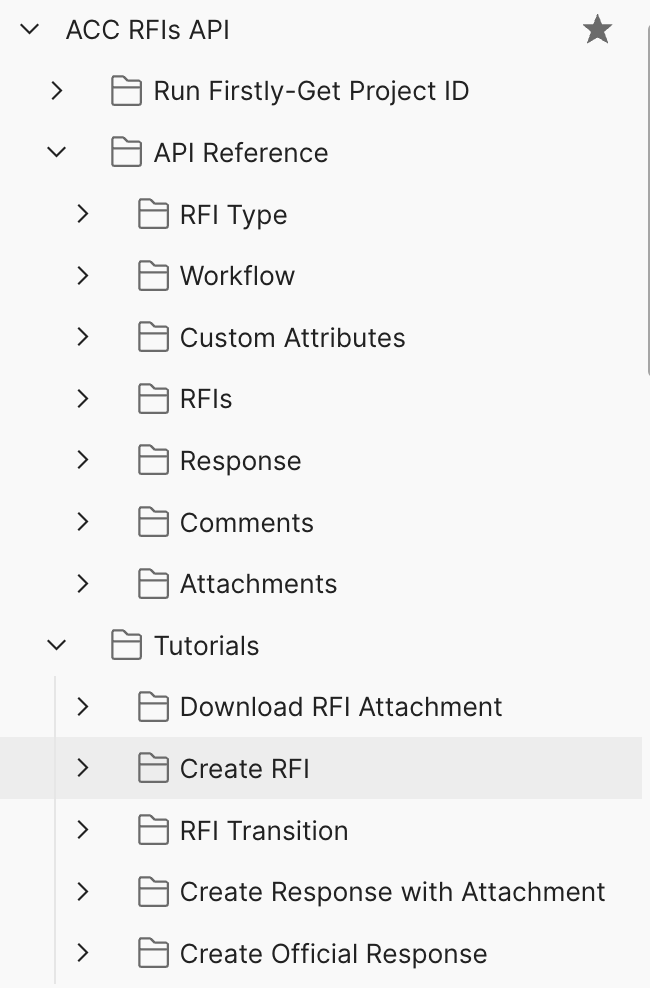
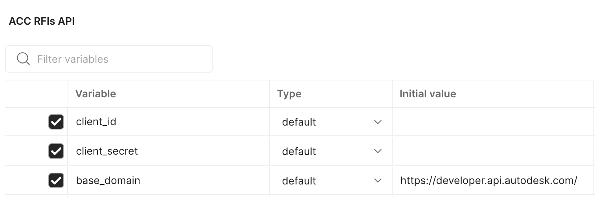
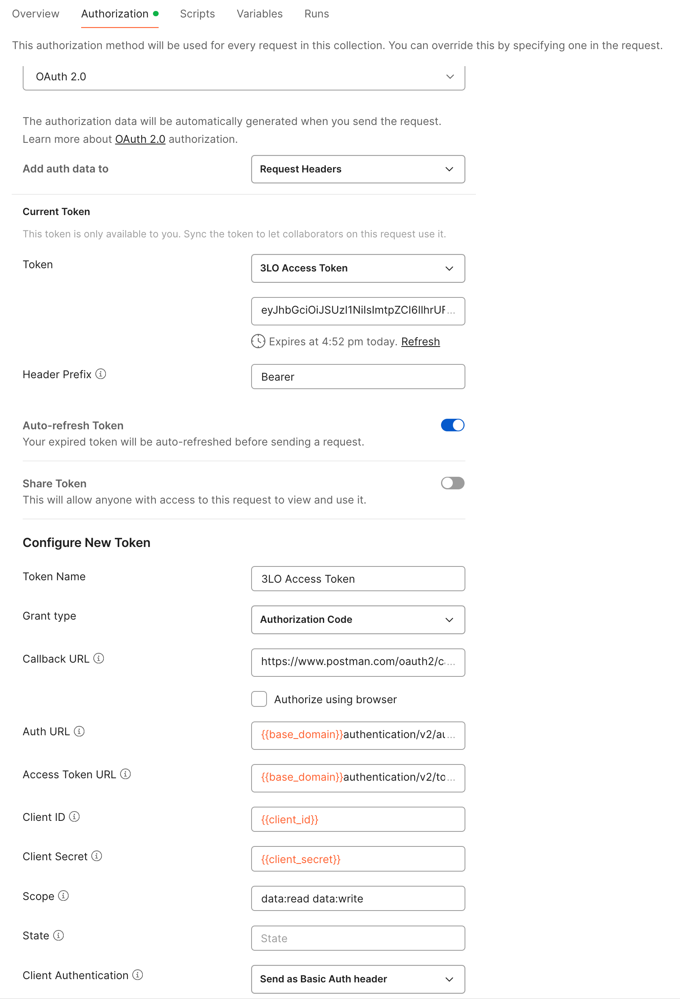
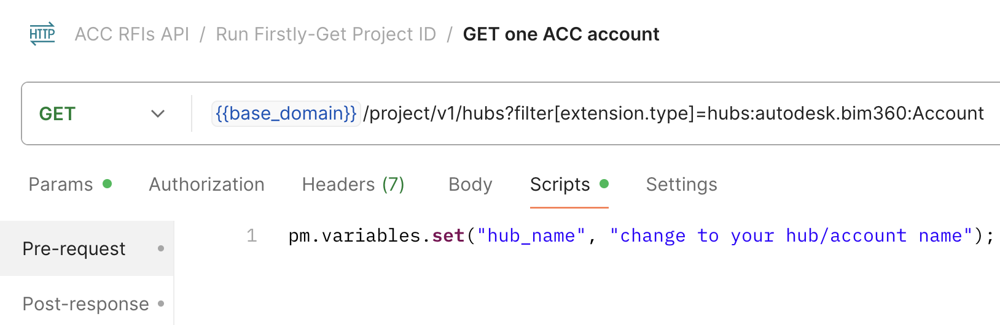
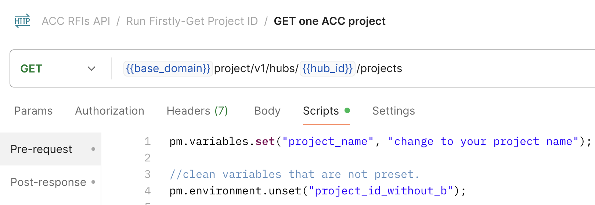

# Postman Collection for ACC RFIs API

This folder contains a Postman Collection that includes all the current ACC RFIs API. The collection together with the environment help you easily test these endpoints.

    

  

## Instructions to run the Postman collection are as below

### Setup Postman environment and Authorization
- Import Postman environment & collection, please setup the following environment vialables, 
    - client_id:     APS App Id.
    - client_secret: APS App Secret.

  
 
 

- Please add the Authorization for the collection, click on the **Collection** folder, go to **Authorization** tab, make sure to use **OAuth 2.0** to get a 3 legged token, use it in the **Request Headers**.
    - Callback URL: https://www.postman.com/oauth2/callback
    - Auth URL: https://developer.api.autodesk.com/authentication/v2/authorize
    - Access Token URL: https://developer.api.autodesk.com/authentication/v2/token

  
 
 

### Prepare Project ID
Under **Run Firstly-Get Project ID**:
1. Input the account(hub) name in pre-scripts of **GET one ACC account**, this will get the account(hub) id of ACC account.

 

  
 

2. Input the project name in pre-scripts of **GET one ACC project**, this will get the project id of ACC account from step #1. `project_id_with_b` will be used for working with RFI attachment uploading (Data Managament API). `project_id_without_b` will be used for all RFI APIs. 

  
 
 

## Tips & Tricks
- These endpoints are used to quickly test/verify the endpoints. You need to set up the environment variables before running the Postman request.

## License
This sample is licensed under the terms of the [MIT License](http://opensource.org/licenses/MIT). Please see the [LICENSE](../LICENSE) file for full details.

## Written by
Xiaodong Liang [@coldwood](https://twitter.com/coldwood), [Developer Advocate and Support](http://aps.autodesk.com)
